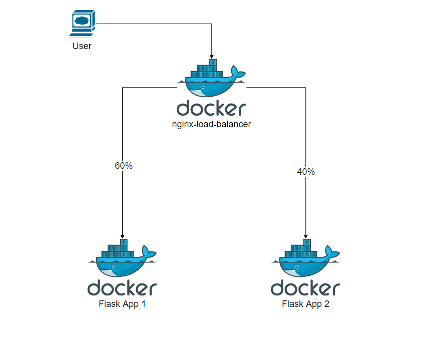

# Load Balancing solution with Docker and nginx 
# Web App using Flask

```sh
docker-compose build
```
```sh
docker-compose up
```

Verify the deployment by navigating to your server address in

your preferred browser.

```sh
127.0.0.1:5008
```

